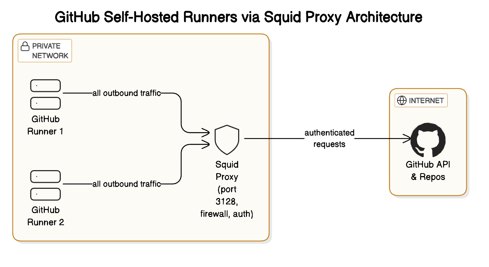

# on-premise-nodes
Create an example project to demonstrate how to use the on-premise private server nodes in Github Actions.

# High Level Architecture Diagram



# on-premise-nodes
This is only connected to a Proxy Server running with Squid.

# Proxy Server
## Squid
Squid is a caching and forwarding HTTP web proxy. It is used to improve web performance by caching frequently requested content and reducing bandwidth usage. Squid can also be used to control access to the internet and filter web content.
## Squid Configuration
The Squid configuration file is located at `/etc/squid/squid.conf`. The default configuration file is located at `/etc/squid/squid.conf.default`. The default configuration file is a good starting point for most users. The configuration file is divided into sections, each section contains a specific type of configuration. The sections are as follows:
- `http_port`: This section defines the port on which Squid will listen for incoming requests. The default port is 3128.
- `acl`: This section defines access control lists (ACLs) that can be used to control access to the proxy server. ACLs can be used to allow or deny access to specific IP addresses, networks, or domains.
- `http_access`: This section defines the access control rules that will be applied to incoming requests. The rules are evaluated in order, and the first rule that matches the request will be applied. If no rules match, the request will be denied.
- `cache`: This section defines the caching behavior of Squid. The caching behavior can be configured to cache specific types of content, or to cache content for a specific amount of time.
- `logformat`: This section defines the format of the log files that Squid will generate. The log files can be used to monitor the performance of the proxy server and to troubleshoot issues.
- `access_log`: This section defines the location of the access log file. The access log file contains a record of all requests that are processed by Squid.
- `cache_log`: This section defines the location of the cache log file. The cache log file contains a record of all cached content and cache hits and misses.
- `cache_dir`: This section defines the location of the cache directory. The cache directory is where Squid will store cached content.
- `refresh_pattern`: This section defines the refresh patterns that will be used to determine how long content should be cached. The refresh patterns can be used to cache specific types of content for a specific amount of time.
- `error_directory`: This section defines the location of the error directory. The error directory contains custom error pages that will be displayed to users when an error occurs.
- `visible_hostname`: This section defines the hostname that will be displayed in error messages. The hostname should be set to the hostname of the proxy server.
- `cachemgr_passwd`: This section defines the password that will be used to access the cache manager. The cache manager is a web-based interface that can be used to monitor and manage the proxy server.
- `cachemgr`: This section defines the location of the cache manager. The cache manager is a web-based interface that can be used to monitor and manage the proxy server.
- `cachemgr_port`: This section defines the port on which the cache manager will listen for incoming requests. The default port is 3128.
- `cachemgr_acl`: This section defines the access control list (ACL) that will be used to control access to the cache manager. The ACL can be used to allow or deny access to specific IP addresses, networks, or domains.
- `cachemgr_access`: This section defines the access control rules that will be applied to incoming requests to the cache manager. The rules are evaluated in order, and the first rule that matches the request will be applied. If no rules match, the request will be denied.
- `cachemgr_logformat`: This section defines the format of the log files that will be generated by the cache manager. The log files can be used to monitor the performance of the proxy server and to troubleshoot issues.
- `cachemgr_access_log`: This section defines the location of the access log file for the cache manager. The access log file contains a record of all requests that are processed by the cache manager.
- `cachemgr_cache_dir`: This section defines the location of the cache directory for the cache manager. The cache directory is where the cache manager will store cached content.
- `cachemgr_refresh_pattern`: This section defines the refresh patterns that will be used to determine how long content should be cached by the cache manager. The refresh patterns can be used to cache specific types of content for a specific amount of time.
- `cachemgr_error_directory`: This section defines the location of the error directory for the cache manager. The error directory contains custom error pages that will be displayed to users when an error occurs.
- `cachemgr_visible_hostname`: This section defines the hostname that will be displayed in error messages for the cache manager. The hostname should be set to the hostname of the proxy server.
- `cachemgr_cachemgr_passwd`: This section defines the password that will be used to access the cache manager. The cache manager is a web-based interface that can be used to monitor and manage the proxy server.
- `cachemgr_cachemgr`: This section defines the location of the cache manager. The cache manager is a web-based interface that can be used to monitor and manage the proxy server.

# Squid Configuration Example
```bash
# Squid configuration file
# /etc/squid/squid.conf
# Define the port on which Squid will listen for incoming requests
http_port 3128
# Define access control lists (ACLs)
acl localnet src 192.168.100.0/24
http_access allow localnet
http_access deny all

